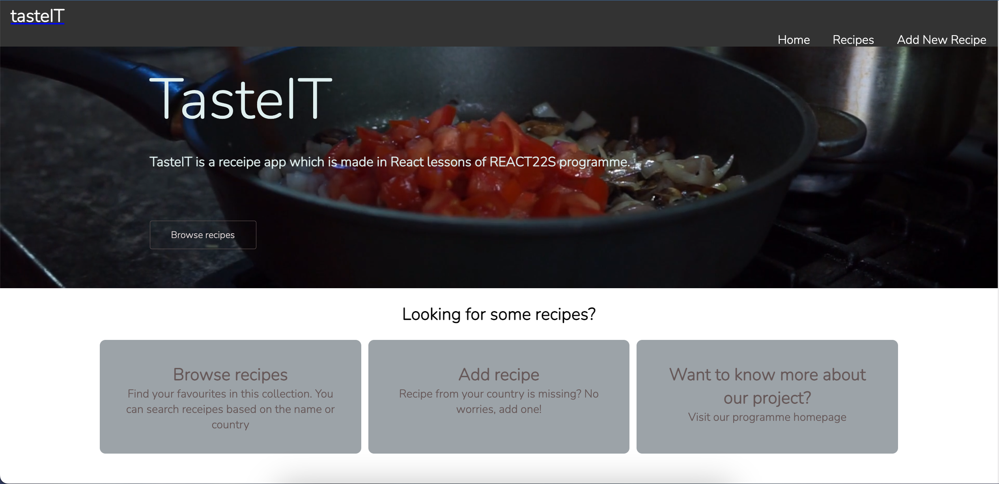
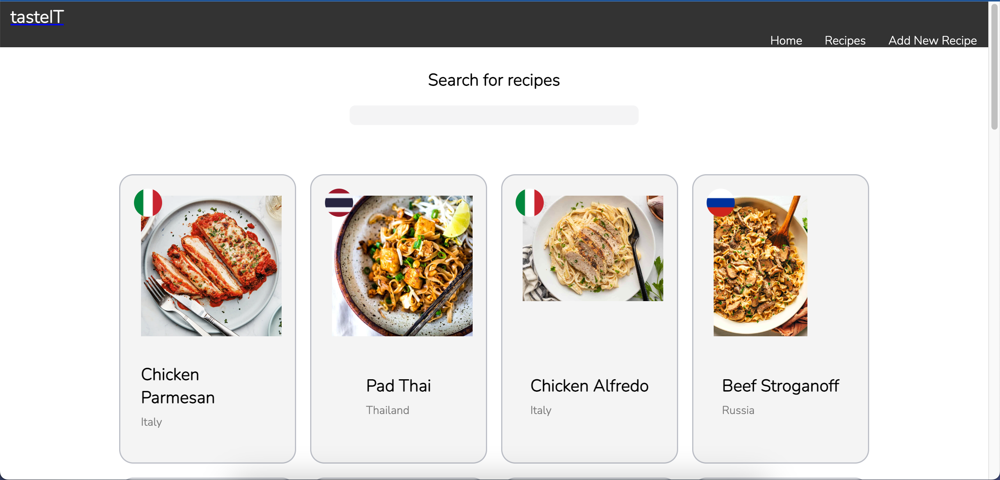
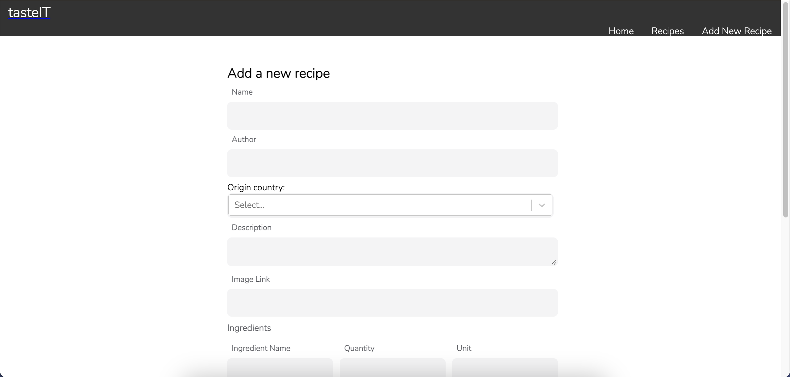

# TasteIT:

## Short description

Welcome to my TasteIT application. This application is created as a task assigned to me as a part of my studies in REACT22S programme.

TasteIT is a web application where users can add their own food recipes from their own traditional kitchen as well as from around the world. Users also can browse the list of recipes added to the database by other users.

## Technologies used

### Built with:

- REACT
- CSS
- JS
- JSX
- HTML
- JSON
- FIREBASE (Real-time database)

## Setup and usage

Live page [here](https://codelamat.github.io/tasteIT/).

## Screenshot

### Homepage

### Recipes page

### Add recipe page

### Authors and acknowledgment

Eyvaz Alishov

- GitHub @CodeLaMat
- [LinkedIn](https://www.linkedin.com/in/eyvaz-alishov-54361054/)

## License

Copyright © 2022 [Eyvaz Alishov] (https://github.com/CodeLaMat)

This project is [MIT] licensed (https://github.com/CodeLaMat/tasteIT/blob/master/LICENSE)

# Getting Started with Create React App

This project was bootstrapped with [Create React App](https://github.com/facebook/create-react-app).

## Available Scripts

In the project directory, you can run:

### `npm start`

Runs the app in the development mode.\
Open [http://localhost:3000](http://localhost:3000) to view it in your browser.

The page will reload when you make changes.\
You may also see any lint errors in the console.
